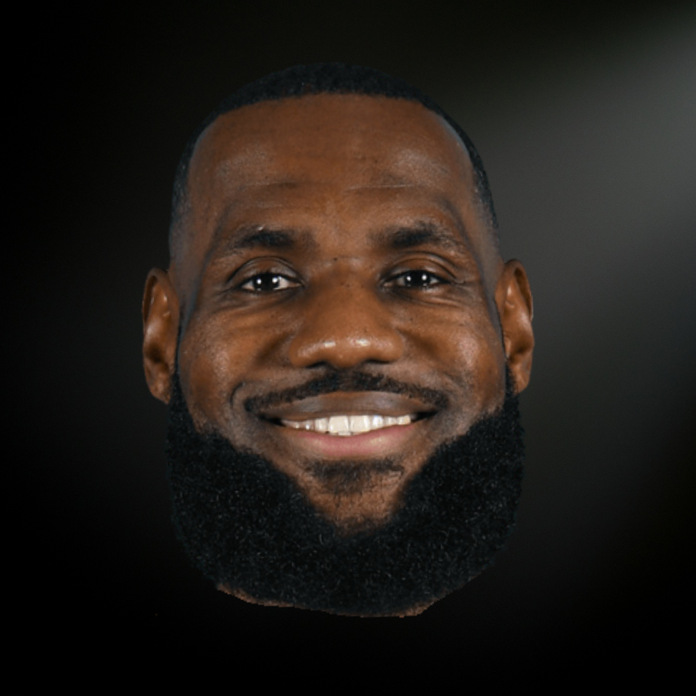

<p align="center">
  
</p>

<h1 align="center">LEBRONIFY</h1>
<p align="center"><strong>The King's Parody Collection</strong></p>
<p align="center">
  A Spotify-inspired web music player featuring 49 LeBron James parody songs.<br>
  Every song. Every parody. All LeBron.
</p>

<p align="center">
  <a href="https://lebronify.app">Live Demo</a> &bull;
  <a href="#features">Features</a> &bull;
  <a href="#screenshots">Screenshots</a> &bull;
  <a href="#getting-started">Getting Started</a>
</p>

---

## What is LeBronify?

LeBronify is a fully functional web-based music player themed entirely around LeBron James parody songs. It features a polished Spotify-like interface with a dark theme, gold accents, and basketball-inspired UX touches throughout.

The app includes a marketing landing page (`index.html`) and a full single-page music player (`app.html`) — no frameworks, no build tools, no dependencies. Just vanilla HTML, CSS, and JavaScript.

## Features

### Full Music Player
- Play, pause, skip, and scrub through 49 parody tracks
- Shuffle mode and repeat (off / all / one)
- Queue management with drag-to-reorder ("On The Bench")
- Dynamic gradient backgrounds extracted from album artwork
- Volume control and progress scrubbing
- Mini "Now Playing" bar across all views

### Smart Collections
- **LeBron's Pick of the Day** — rotates a featured song daily
- **Recent Highlights** — last 20 played tracks
- **MVP Selections** — most-played songs ranked with gold badges (#1, #2, #3)
- **All-Stars** — user-favorited tracks
- **Playbooks** — create unlimited custom playlists

### The Fun Stuff

#### Chalk Toss Animation
Every time a song starts playing, LeBron's signature pre-game chalk toss fires — hands toss upward as chalk powder billows toward the ceiling. Pure CSS + JS animation.

#### Taco Tuesday Mode
On Tuesdays, the Home Court view gets a rain of falling tacos, a special Taco Tuesday banner appears, and there's a 60% chance LeBron's "TACO TUESDAYYYYY" becomes the Song of the Day.

#### Anthony Davis "AD" Breaks
Random popup interruptions between songs featuring AD with ridiculous messages. 8 unique variations with dismissal buttons like "Trade AD to Dallas" and "Wax the Brow."

#### Mix Generator
"Create a Mix" builds a smart playlist — one song per artist, up to 10 tracks, shuffled and ready to go.

### Search
- Real-time search across song titles and artists
- Pre-filled with recent plays and suggested tracks when empty
- Chip-style quick-play buttons for recently played songs

### Responsive Design
- Desktop: sidebar navigation with full queue panel
- Mobile: bottom tab bar with frosted glass effect, swipe-friendly layout
- Works across all modern browsers

### Persistence
All play counts, favorites, playlists, and recently played data are saved to `localStorage` — your stats survive page refreshes and browser restarts.

## Tech Stack

| Layer | Technology |
|-------|-----------|
| Markup | HTML5 |
| Styling | CSS3 (custom properties, flexbox, grid, keyframe animations) |
| Logic | Vanilla JavaScript (ES6+) |
| Audio | HTML5 Audio API |
| Storage | localStorage |
| Fonts | [Inter](https://fonts.google.com/specimen/Inter) via Google Fonts |
| Icons | Custom inline SVGs (no icon library) |
| Frameworks | None |
| Build Tools | None |

## Project Structure

```
lebronify-website/
├── index.html          # Marketing landing page
├── app.html            # Web player (SPA)
├── app.js              # Player engine (~60KB)
├── app.css             # Player styles
├── script.js           # Landing page interactions
├── styles.css          # Landing page styles
├── songs/              # 49 MP3 audio files
└── images/
    ├── ui/             # UI assets (banners, icons, AD poses)
    └── albums/         # 49 album artwork images
```

## Getting Started

### Run Locally

No install or build step needed. Just serve the files:

```bash
# Clone the repo
git clone https://github.com/robwizzie/lebronify-website.git
cd lebronify-website

# Serve with any static server
python3 -m http.server 8000
# or
npx serve .
```

Then open `http://localhost:8000` in your browser.

### Deploy

This is a fully static site — it works on any static hosting provider with zero configuration:

- **GitHub Pages** — push to `main`, enable Pages in repo settings
- **Netlify** — connect repo, deploy with no build command
- **Vercel** — import repo, deploy as-is

## Song Roster

49 parody tracks from creators including **ilyaugust**, **musicbykidb**, **timringling**, **House of Highlights**, and more.

<details>
<summary>View all 49 songs</summary>

| # | Title | Artist |
|---|-------|--------|
| 1 | Ain't It Bron | hen.bouselog |
| 2 | All LeBron Things | jeremytache |
| 3 | Bring Me Back To Bron | LeBron Fan |
| 4 | Bron Royalty | ilyaugust |
| 5 | Bronpeii | ilyaugust |
| 6 | Brons Not Brongedies | ilyaugust |
| 7 | Brontastic | ilyaugust |
| 8 | Catch a LeNade For You | ilyaugust |
| 9 | Dear LeBron | sdotreidy |
| 10 | Dunk With a Smile | LeBron Fan |
| 11 | He Is LeBron James | My Way |
| 12 | He Is The King | LeBron Fan |
| 13 | I'm Like That's Bron | ilyaugust |
| 14 | I Believe in LeBron | imakeparodyzz |
| 15 | I Glazed LeBron (And I Liked It) | timringling |
| 16 | In The Bron | ilyaugust |
| 17 | La Bron Bron Land | House of Highlights |
| 18 | Le Bronba | enrique_l_garibay |
| 19 | LeAfrica | standleyjohnsonmusic |
| 20 | LeAll of Me | musicbykidb |
| 21 | LeBron, LeBron, LeBron | LeBron Fan |
| 22 | LeBron Has Taken a Toll | ilyaugust |
| 23 | LeBron That I Used to Know | LeBron Fan |
| 24 | LeBronifornia Girls | izzydrip |
| 25 | LeBrons Wide Open | timringling |
| 26 | LeCurious James | leiheart.radio.station |
| 27 | LeEarned It | kai.so |
| 28 | LeGolden Hour | ilyaugust |
| 29 | LeHips Don't Lie | ant.jr06 |
| 30 | LeLove Yourself | musicbykidb |
| 31 | LeStiches | ilyaugust |
| 32 | Let LeBron Know | LeBron Fan |
| 33 | Life is a LeHighway | jeppreyjung |
| 34 | Man On The Lakers | Talented Blake |
| 35 | Marry Bron | ilyaugust |
| 36 | No Bron | ilyaugust |
| 37 | Not Like Bron | vonpierreofficial |
| 38 | Oh Mr LeBron | LeBron Fan |
| 39 | Romantic Bronicide | ilyaugust |
| 40 | Shut Up and Dance With Bron | ilyaugust |
| 41 | Still Glazing You | musicbykidb |
| 42 | Sweet LeScape | ilyaugust |
| 43 | TACO TUESDAYYYYY | LeBron James |
| 44 | That's Bron | JJ Darrow |
| 45 | That's What Makes Bron Beautiful | ilyaugust |
| 46 | Thinkin Bout LeBron | ilyaugust |
| 47 | This is The Bron | fanoftatum0 |
| 48 | Towards The Bron | ilyaugust |
| 49 | You Are My Sunshine | LeBron Fan |

</details>

## Design

The app uses a dark theme with gold (`#FFD700`) as the primary accent color — matching LeBron's crown aesthetic. The design system uses CSS custom properties for consistent theming:

- **Background tiers:** `#121212` → `#1C1C1C` → `#181818`
- **Text opacity tiers:** 100% → 70% → 50% → 30% → 10%
- **Accent:** Gold `#FFD700` with glow variants
- **Font:** Inter (400–900 weights)
- **Responsive breakpoints:** 900px (tablet), 480px (mobile)

## Disclaimer

This is a parody/fan project — not affiliated with LeBron James, the NBA, or any record label. All parody songs are created by independent fan creators. Built for fun, powered by pure glazing.

---

<p align="center">
  Made with  for LeBron fans everywhere
</p>
